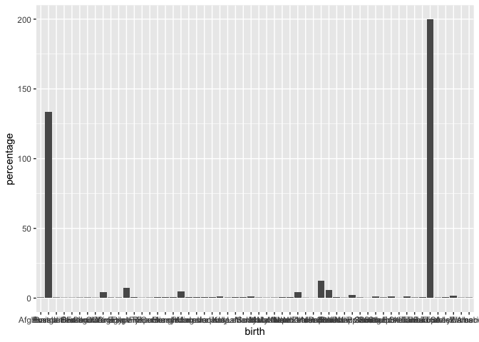

<!-- README.md is generated from README.Rmd. Please edit that file -->

# ausbirthplace

<!-- badges: start -->
<!-- badges: end -->

The goal of ausbirthplace is to provide data about the place of birth of
Australian residents from the 2016 and 2019 census.

## Installation

You can install the development version of ausbirthplace like so:

``` r
remotes::install_github("MikeLydeamore/ausbirthplace")
```

## Example

This is a basic example which shows you how to solve a common problem:

``` r
library(ausbirthplace)
library(ggplot2)

ggplot(census_birthplace, aes(x=birth, y = percentage)) +
  geom_col()
```


